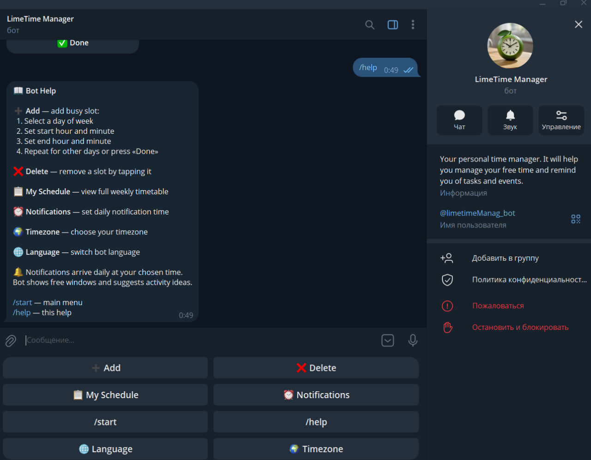

# ⏰ Time Manager

A smart Telegram bot for time management with AI-powered activity suggestions.

---

## 📸 Demo

### Help



### Main Menu


### Adding Busy Time


### Notifications with AI Ideas


---

## 🧠 Product Context

### End Users

Students and busy individuals who want to better manage their daily schedule and use their free time effectively.

### Problem

People often struggle to organize their time and don't know how to use their free time productively.

### Solution

The application analyzes the user's schedule, identifies free time slots, and generates personalized activity suggestions using AI. Users manage everything through a convenient Telegram bot interface.

---

## ⚙️ Features

### ✅ Implemented

- Add busy time slots using button selectors (hour and minute)
- Delete busy slots by tapping on them
- View full weekly schedule sorted by day
- Conflict detection — prevents overlapping time slots
- Daily notifications at a user-chosen time
- Timezone support (20+ presets including Moscow, UTC, US cities)
- Bilingual interface — Russian and English
- AI-powered activity suggestions for free time (Qwen LLM via OpenRouter)
- Persistent keyboard with quick-access buttons

### ❌ Not Implemented (Future Work)

- Web dashboard interface
- User preferences and activity history tracking
- Recurring events (e.g. "every Monday 10:00-12:00")
- Statistics and analytics (weekly reports, charts)
- Integration with Google Calendar / Apple Calendar

---

## 🧑‍💻 Usage

1. Open the bot in Telegram and press **/start**
2. Tap **➕ Добавить / Add** to set busy time:
   - Select a day of the week
   - Pick start hour → start minute → end hour → end minute
   - Repeat for other days or press **✅ Done**
3. Tap **📋 Моя занятость / My Schedule** to view your weekly timetable
4. Tap **⏰ Напоминания / Notifications** to set your daily reminder time
5. Tap **🌍 Часовой пояс / Timezone** to select your timezone
6. Tap **🌐 Язык / Language** to switch between Russian and English

Every day at your chosen time, the bot sends a notification with your free time slots and AI-generated activity ideas.

---

## 🚀 Deployment

### Requirements

- **OS:** Ubuntu 24.04
- **Installed:**
  - Docker
  - Docker Compose

### Steps to Deploy

1. Clone the repository:

```bash
git clone https://github.com/Belks53/se-toolkit-hackathon.git
cd se-toolkit-hackathon
```

2. Create and configure environment variables file:

```bash
cp .env.example .env
```

Edit the `.env` file and add your credentials:

| Variable | Description |
|----------|-------------|
| `BOT_TOKEN` | Telegram bot token (from @BotFather) |
| `OPENAI_API_KEY` | OpenRouter API key (from https://openrouter.ai/) |
| `DB_HOST` | PostgreSQL host (use `db` for Docker Compose) |
| `DB_USER` | Database username (default: `postgres`) |
| `DB_PASSWORD` | Database password (default: `password`) |
| `DB_NAME` | Database name (default: `telegram_bot`) |

> ⚠️ **Important:** The `.env` file contains sensitive data and is automatically excluded from Git. Never commit it to the repository!

3. Start the application:

```bash
docker-compose up --build -d
```

4. Open your bot in Telegram and press **/start**.

### Stopping the Application

```bash
docker-compose down
```
