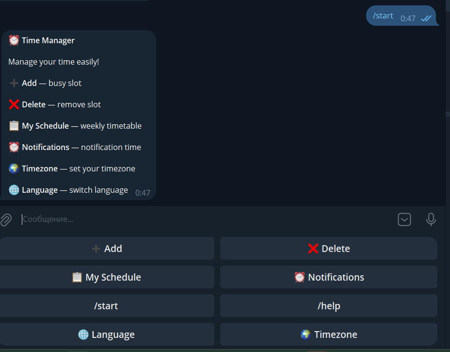
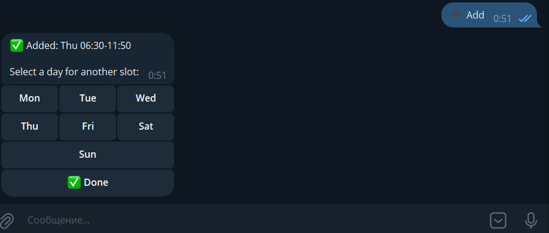
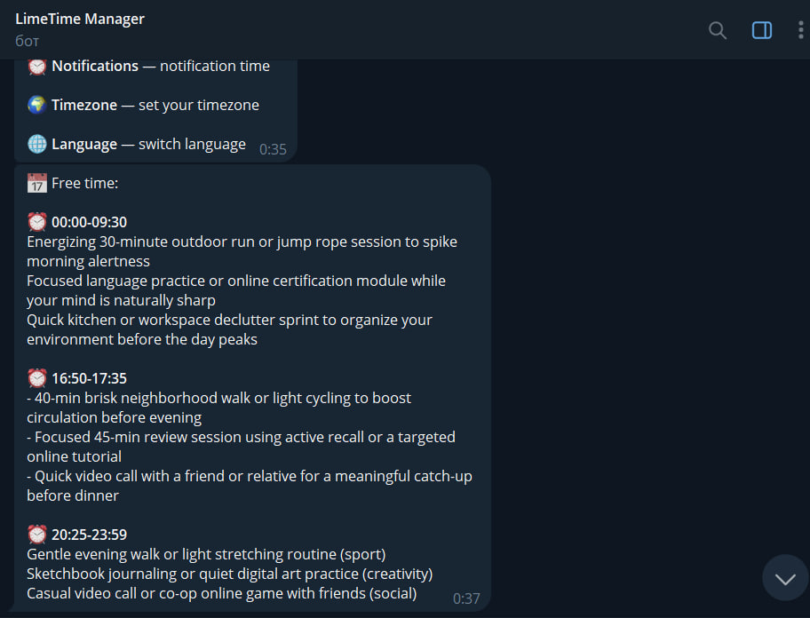

# ⏰ Time Manager

A smart Telegram bot for time management with AI-powered activity suggestions and automatic fallback messages.

---

## 📸 Demo

### First Launch - Language Selection


### First Launch - Timezone Selection


### Main Menu



### Adding Busy Time



### Notifications with AI Ideas



---

## 🧠 Product Context

### End Users

Students, professionals, and busy individuals who want to better manage their daily schedule and use their free time effectively without spending time figuring out what to do.

### Problem

People often struggle to organize their time efficiently and don't know how to use their free time productively. They waste time deciding what activity to pursue, and sometimes miss opportunities for self-improvement, relaxation, or skill development.

### Solution

Time Manager is a Telegram bot that analyzes your schedule, automatically identifies free time slots, and generates personalized activity suggestions using AI. When AI is unavailable, the bot provides curated fallback messages tailored to the time of day. Users manage everything through a convenient Telegram bot interface with an intuitive first-time setup flow for language and timezone configuration.

---

## ⚙️ Features

### ✅ Implemented

- **First Launch Flow** — Automatic language and timezone selection on first bot launch
- Add busy time slots using button selectors (hour and minute)
- Delete busy slots by tapping on them
- View full weekly schedule sorted by day
- Conflict detection — prevents overlapping time slots
- Daily notifications at a user-chosen time
- Timezone support (20+ presets including Moscow, UTC, US cities)
- Bilingual interface — Russian and English
- AI-powered activity suggestions for free time (Qwen LLM via OpenRouter)
- **Multi-Provider LLM Fallback** — Tries OpenRouter free models first, then Mistral AI as backup
- **Smart Fallback System** — 30 pre-written messages per time period (morning, afternoon, evening, night) when LLM is unavailable
- Persistent keyboard with quick-access buttons
- Help system with detailed instructions

### ❌ Not Implemented (Future Work)

- Web dashboard interface
- User preferences and activity history tracking
- Recurring events (e.g. "every Monday 10:00-12:00")
- Statistics and analytics (weekly reports, charts)
- Integration with Google Calendar / Apple Calendar
- Custom activity categories and user-defined suggestions
- Multi-platform support (WhatsApp, Viber, etc.)

---

## 🧑‍💻 Usage

### First Launch

1. Open the bot in Telegram and press **/start**
2. **Select your language** (🇷🇺 Русский or 🇬🇧 English)
3. **Select your timezone** from the list of available options
4. You'll receive a confirmation message — the bot is now ready to use!

### Daily Use

1. Tap **➕ Добавить / Add** to set busy time:
   - Select a day of the week
   - Pick start hour → start minute → end hour → end minute
   - Repeat for other days or press **✅ Done**
2. Tap **📋 Моя занятость / My Schedule** to view your weekly timetable
3. Tap **❌ Удалить / Delete** to remove a busy slot
4. Tap **⏰ Напоминания / Notifications** to set your daily reminder time
5. Tap **🌍 Часовой пояс / Timezone** to change your timezone
6. Tap **🌐 Язык / Language** to switch between Russian and English

### Notifications

Every day at your chosen time, the bot sends a notification with:
- Your available free time slots
- AI-generated activity suggestions (or curated fallback messages if AI is unavailable)

The fallback system automatically selects contextually appropriate messages based on:
- **Morning (5:00-12:00)**: Active suggestions like workouts, breakfast, planning
- **Afternoon (12:00-17:00)**: Productive activities like sports, projects, learning
- **Evening (17:00-22:00)**: Relaxing activities like movies, reading, meditation
- **Night (22:00-5:00)**: Calm activities like stargazing, journaling, sleep prep

---

## 🚀 Deployment

### Requirements

- **OS:** Ubuntu 24.04 (or any Linux distribution with Docker support)
- **Installed:**
  - Docker
  - Docker Compose
  - Git

### Step-by-Step Deployment Instructions

1. **Install prerequisites** (if not already installed):

```bash
sudo apt update
sudo apt install -y docker.io docker-compose-plugin git
sudo systemctl enable --now docker
```

2. **Clone the repository:**

```bash
git clone https://github.com/Belks53/se-toolkit-hackathon.git
cd se-toolkit-hackathon
```

3. **Create and configure environment variables file:**

```bash
cp .env.example .env
```

Edit the `.env` file and add your credentials:

```bash
nano .env
```

| Variable | Description |
|----------|-------------|
| `BOT_TOKEN` | Telegram bot token (from @BotFather) |
| `OPENAI_API_KEY` | OpenRouter API key (from https://openrouter.ai/) |
| `MISTRAL_API_KEY` | Mistral AI API key — optional backup (from https://console.mistral.ai/) |
| `LLM_MODEL` | Primary OpenRouter model (default: `google/gemma-4-26b-a4b-it:free`) |
| `DB_HOST` | PostgreSQL host (use `db` for Docker Compose) |
| `DB_USER` | Database username (default: `postgres`) |
| `DB_PASSWORD` | Database password (default: `password`) |
| `DB_NAME` | Database name (default: `telegram_bot`) |

> ⚠️ **Important:** The `.env` file contains sensitive data and is automatically excluded from Git. Never commit it to the repository!

4. **Start the application:**

```bash
docker compose up --build -d
```

5. **Verify the bot is running:**

```bash
docker compose logs -f app
```

You should see logs indicating the bot has started and connected.

6. **Open your bot in Telegram** and press **/start** — you'll be guided through the first-time setup flow!

### Stopping the Application

```bash
docker compose down
```

### Restarting the Application

```bash
docker compose restart
```

### Updating the Application

```bash
git pull
docker compose up --build -d
```

---

## 📁 Project Structure

```
se-toolkit-hackathon/
├── app/
│   ├── bot.py          # Main bot logic and handlers
│   ├── config.py       # Configuration and environment variables
│   ├── db.py           # PostgreSQL database operations
│   ├── keyboards.py    # Inline and reply keyboard builders
│   ├── lang.py         # Language strings and fallback messages
│   ├── llm.py          # AI-powered activity suggestions
│   └── scheduler.py    # APScheduler for daily notifications
├── docker-compose.yml  # Docker Compose configuration
├── Dockerfile          # Application container definition
├── requirements.txt    # Python dependencies
├── .env.example        # Environment variables template
└── README.md           # This file
```

---

## 🛠 Tech Stack

- **Backend:** Python 3.11+
- **Bot Framework:** aiogram 3.x
- **Database:** PostgreSQL with asyncpg
- **Scheduler:** APScheduler
- **AI/LLM:** OpenRouter (Qwen, Llama, Gemma) + Mistral AI backup
- **Deployment:** Docker & Docker Compose
